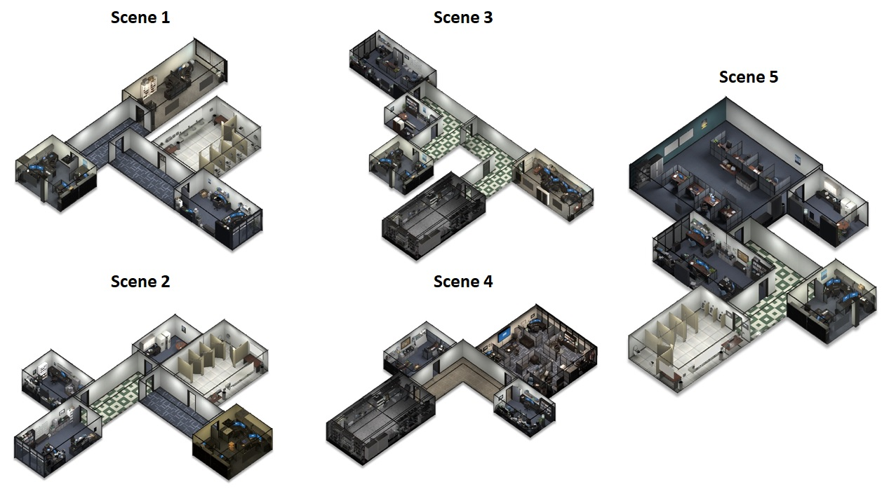

## Additional problem details

### Scenes

The Unity simulator has 5 office-like scenes.

Each scene consists of or two hallways with several rooms connected to the the hallway.
Types of rooms include an office, cubical space, a restroom, a break room, and a storage room.

### Target Fruit

The target fruit includes an apple, a banana, a strawberry, an orange, and a cherry.

Fruit are randomly spawned throughout the environment.
However, their distribution is non-uniform.
Fruit are spawned in offices and cubical spaces.
Sometimes they spawn in a hallway just outside of an office.
They don't spawn in other rooms (e.g., restroom, breakroom).

### Semantics

There are 10 semantic categories for objects as follows.
- 0: floor (0,171,143)
- 1: ceiling (1,155,211)
- 2: wall (2,222,110)
- 3: monitor (3,69,227)
- 4: door (4,218,221)
- 5: table (5,81,38)
- 6: chair (6,229,176)
- 7: storage (7,106,60)
- 8: couch (8,179,10)
- 9: clutter (9,118,90)
- 10: target fruit (10,138,80)

The values in parentheses correspond to (red-green-blue) RGB values when semantic segmentation is displayed in videos or directly obtained from the simulator as a 3-channel image (instead of a single channel).

## Disclaimer

DISTRIBUTION STATEMENT A. Approved for public release. Distribution is unlimited.

This material is based upon work supported by the Under Secretary of Defense for Research and Engineering under Air Force Contract No. FA8702-15-D-0001. Any opinions, findings, conclusions or recommendations expressed in this material are those of the author(s) and do not necessarily reflect the views of the Under Secretary of Defense for Research and Engineering.

(c) 2020 Massachusetts Institute of Technology.

MIT Proprietary, Subject to FAR52.227-11 Patent Rights - Ownership by the contractor (May 2014)

The software/firmware is provided to you on an As-Is basis

Delivered to the U.S. Government with Unlimited Rights, as defined in DFARS Part 252.227-7013 or 7014 (Feb 2014). Notwithstanding any copyright notice, U.S. Government rights in this work are defined by DFARS 252.227-7013 or DFARS 252.227-7014 as detailed above. Use of this work other than as specifically authorized by the U.S. Government may violate any copyrights that exist in this work.