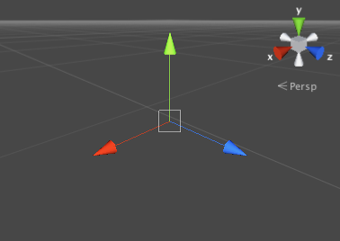
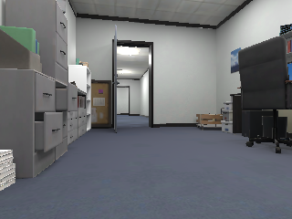
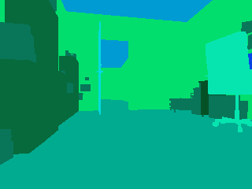
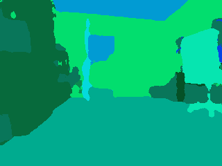
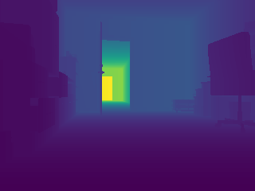
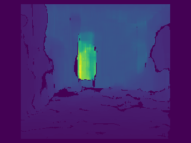
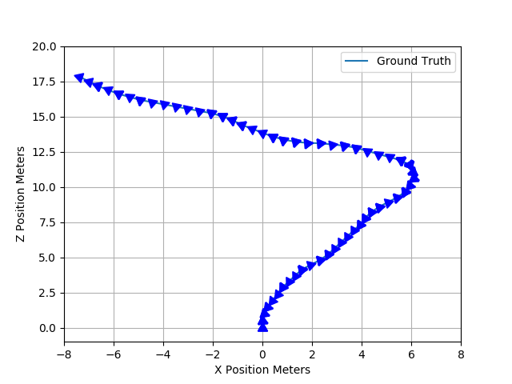
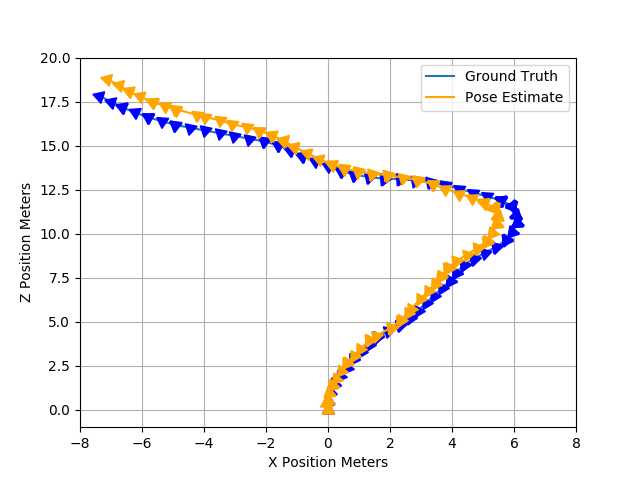

# Perception Pipeline

As stated in the challenge overview, we provide two data sources: one is the simulator **Ground Truth** and the other is a realistic **Perception Pipeline**.

1. __Ground Truth__: The agent observes ground truth (i.e., error free) information that is provided directly from the simulator.
2. __Perception Pipeline__: The agent observes output of [Kimera](http://web.mit.edu/sparklab/2019/10/13/Kimera__an_Open-Source_Library_for_Real-Time_Metric-Semantic_Localization_and_Mapping.html), which is an open-source C++ library for real-time metric-semantic visual-inertial Simultaneous Localization And Mapping (SLAM).
Note that the types (and dimensions) of observations provided are the same as before; however, the error characteristics are now representative of a real perception system.

This page gives an overview of [Data Conventions](#data-conventions) and the [Perception Pipeline Algorithms](#perception-pipeline-algorithms).

## Data Conventions

Th agent observes several data products: monocular RGB, semantic segmentation, depth, and agent pose. 
Conventions related to these data products are as follows.

### Semantic Segmentation

See the [details page](https://github.mit.edu/TESS/goseek-challenge/blob/perception-docs/doc/details.md#semantics) for a list of the semantic segmentation classes and corresponding RGB values. Note, the class index corresponds to the value of the first color channel. 

### Depth

Depth is rendered within a specified range, known as [clip planes](https://docs.unity3d.com/Manual/class-Camera.html), and then mapped to the range `[0, 1]`. The simulator uses minimum and maximum clip planes of `0.05` and `50`, so to recover depth in meters multiply the provided image by `50`. Note, depth beyond 50 meters is truncated. In the [evaluation interface](https://github.mit.edu/TESS/goseek-challenge/blob/master/Instructions.md#local-evaluation) this would look like:

```python 
from tesse_gym.tasks.goseek import decode_observations 
 
class Agent:
    """ Interface for submitting an agent for evaluation. """

    def act(self, observation: np.ndarray) -> int:
        far_clip_plane = 50
        rgb, segmentation, depth, pose = decode_observations(observation)
        depth *= far_clip_plane  # convert depth to meters 
        ...
```
        

### Coordinate System for Poses

We use the left handed coordinate system native to Unity (see [Unity documentation](https://docs.unity3d.com/560/Documentation/Manual/Transforms.html)). For world coordinates, x- and z-axes are aligned with the horizontal plane, and the y-axis is aligned with up. Pose is given as the vector `(x, z, yaw)` where the z-axis is aligned with forward, the x-axis is positive to the right, and yaw is relative to the positive up y-axis.




## Perception Pipeline Algorithms

During evaluation, participants will be provided with realistic perception data from [Kimera](https://github.com/MIT-SPARK/Kimera), an open-source C++ library for real-time metric-semantic visual-inertial Simultaneous Localization And Mapping (SLAM). Realistic perception estimates are obtained by passing ground truth simulator data through this pipeline. Thus, the types and dimensions of observations will remain the same; however, the error characteristics are now representative of a real perception system.

Please note that running the perception pipeline requires significantly more computation than groundtruth.
Episodes will run **several times slower** than when running the groundtruth data pipeline.
The simulator is run in a continuous dynamics mode (compared to discrete dynamics when running the groundtruth data pipeline), and it is outputting imagery at a higher rate.
This higher-rate data is needed for estimating [pose](#pose) only, so agent policies will still receive data at the same rate as before.
In addition, several perception algorithms are now running as described below.

We recommend thinking carefully about how you use this pipeline.
It may be less feasible to generate data with it for policy training, for example.

### Segmentation

A [U-Net](https://arxiv.org/pdf/1505.04597.pdf) provides segmentation estimates for the 11 GOSEEK [semantic classes](https://github.com/MIT-TESSE/goseek-challenge/blob/master/doc/details.md#semantics). The [segmentation-models.pytorch](https://github.com/qubvel/segmentation_models.pytorch) project was used to train the model on data collected from [scenes 1-4](https://github.com/MIT-TESSE/goseek-challenge/blob/master/doc/details.md#scenes) of the GOSEEK simulator. Scene 5 was used to collect a validation set on which the model achieves an Intersection-over-Union (IoU) score of roughly 0.8. The model was then exported to an ONNX file, provided in this [release](https://github.com/MIT-TESSE/tesse-segmentation-ros/releases), for inference in [TensorRT](https://developer.nvidia.com/tensorrt). 

Training details can be found in this [notebook](https://github.com/MIT-TESSE/tesse-segmentation-ros/blob/master/training/train-segmentation-models.ipynb). The inference framework is implemented [here](https://github.com/MIT-TESSE/tesse-segmentation-ros/blob/master/src/tesse_segmentation_ros/models.py#L57).

### Depth
Depth is estimated via stereo reconstruction. Using a stereo image pair from the simulator, we use the ROS [`stereo_image_proc`](http://wiki.ros.org/stereo_image_proc) node to generate a point cloud which is then projected into the camera plane to produce a depth image. 


### Pose 
Pose is provided by [Kimera-VIO](https://github.com/MIT-SPARK/Kimera-VIO), a Visual Inertial Odometry pipeline for State Estimation from Stereo and IMU data.

Below is a comparison of the data provided in Ground Truth and Perception modes. Pose is illustrated over a 100 step trajectory with the carrots representing position and heading every 1 step. 


|                       | Ground Truth                               |  Perception |
:----------------------:|:------------------------------------------:|:-------------------------:
| Monocular RGB         |            |  
| Semantic Segmentation |   |  
| Depth                 |          |  
| Pose                  |                     |   


## Disclaimer

DISTRIBUTION STATEMENT A. Approved for public release. Distribution is unlimited.

This material is based upon work supported by the Under Secretary of Defense for Research and Engineering under Air Force Contract No. FA8702-15-D-0001. Any opinions, findings, conclusions or recommendations expressed in this material are those of the author(s) and do not necessarily reflect the views of the Under Secretary of Defense for Research and Engineering.

(c) 2020 Massachusetts Institute of Technology.

MIT Proprietary, Subject to FAR52.227-11 Patent Rights - Ownership by the contractor (May 2014)

The software/firmware is provided to you on an As-Is basis

Delivered to the U.S. Government with Unlimited Rights, as defined in DFARS Part 252.227-7013 or 7014 (Feb 2014). Notwithstanding any copyright notice, U.S. Government rights in this work are defined by DFARS 252.227-7013 or DFARS 252.227-7014 as detailed above. Use of this work other than as specifically authorized by the U.S. Government may violate any copyrights that exist in this work.


